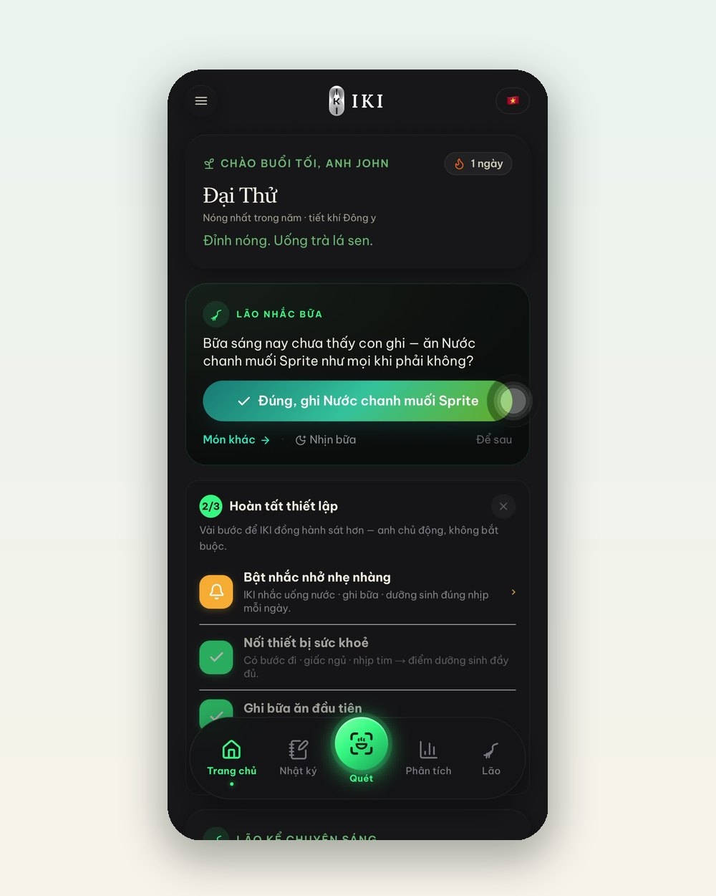

---json
{
  "title": "\"Lão\" — người bạn đồng hành Đông y trong App IKI: nhắc bữa đúng thói quen, gợi ý theo tiết khí",
  "seo_title": "AI đồng hành sức khoẻ 24/7: tính năng Lão và tiết khí trong App IKI",
  "slug": "app-iki-lao-dong-hanh-tiet-khi",
  "description": "Gặp \"Lão\" — nhân vật đồng hành trong App IKI: nhớ thói quen ăn uống của bạn để nhắc bữa bằng một chạm, và mở đầu mỗi ngày bằng gợi ý dưỡng sinh theo tiết khí Đông y. Cá nhân hoá sức khoẻ 24/7 mà không cần gõ một dòng nào.",
  "keyword": "ai đồng hành sức khoẻ",
  "category": "thoi-quen",
  "date": "2026-07-29",
  "author": "Đội ngũ IKI Healing",
  "hero_local": "assets/blog/app-iki-lao-dong-hanh-tiet-khi-hero.jpg",
  "hero_alt": "Điện thoại cạnh tách trà lá sen và tờ lịch",
  "reading_min": 6,
  "answer": "\"Lão\" là nhân vật đồng hành trong App IKI, hoạt động 24/7 theo hai cách chính: (1) nhớ thói quen của bạn — ví dụ bữa sáng bạn hay dùng món gì — để mỗi sáng chỉ cần một chạm xác nhận là món được ghi vào nhật ký; (2) mở đầu mỗi ngày bằng gợi ý dưỡng sinh gắn với tiết khí Đông y đang diễn ra, ví dụ tiết Đại Thử nóng nhất năm thì gợi ý đồ uống thanh mát phù hợp. App là công cụ hỗ trợ lối sống tham khảo, không phải công cụ chẩn đoán y khoa.",
  "faq": [
    {
      "q": "Lão trong App IKI là gì?",
      "a": "Là nhân vật đồng hành được xây trên nền AI, xuất hiện xuyên suốt app: nhắc bữa theo thói quen của chính bạn, ghi nhật ký giúp bạn, kể chuyện dưỡng sinh buổi sáng và trả lời câu hỏi về lối sống theo góc nhìn Đông y. Bạn có thể trò chuyện với Lão bất cứ lúc nào trong tab riêng."
    },
    {
      "q": "Tiết khí là gì mà app lại gợi ý theo nó?",
      "a": "Lịch phương Đông chia năm thành 24 tiết khí — mỗi tiết phản ánh một pha thời tiết như Đại Thử (nóng đỉnh điểm) hay Lập Đông (bắt đầu lạnh). Ẩm thực dưỡng sinh truyền thống chọn món theo tiết khí, và App IKI đưa nhịp đó vào màn hình chính mỗi ngày để gợi ý của app đi cùng thời tiết thật ngoài trời."
    },
    {
      "q": "Tôi phải nhập nhiều dữ liệu thì app mới hiểu tôi đúng không?",
      "a": "Không. Triết lý của App IKI là giảm việc gõ tay tối đa: quét bữa ăn bằng camera, xác nhận nhắc bữa bằng một chạm, và có thể nối thiết bị sức khoẻ sẵn có để bước đi, giấc ngủ, nhịp tim tự chảy vào app."
    }
  ]
}
---

Hầu hết ứng dụng sức khoẻ thất bại vì một lý do rất con người: chúng bắt bạn phục vụ chúng — nhập liệu, chọn menu, nhớ mở app. [App IKI](https://ikihealing.com/app.html) đi đường ngược lại: xây một **người bạn đồng hành** phục vụ bạn. Trong app, người bạn đó tên là **Lão**.

## Buổi sáng của Lão: tiết khí trước, việc cần làm sau

Đây là màn hình chính một buổi trong tiết Đại Thử — giai đoạn nóng nhất năm theo lịch tiết khí Đông y:

Hai thứ đáng chú ý trên màn hình này:

- **Dòng tiết khí ngay đầu trang**: "Đại Thử — nóng nhất trong năm", kèm một gợi ý mùa ngắn gọn. Ông bà ta chọn món theo mùa từ lâu; App IKI chỉ làm việc đó tự động mỗi sáng, đúng ngày đúng tiết.
- **Lão nhắc bữa theo thói quen của chính bạn**: "Bữa sáng nay chưa thấy con ghi — ăn như mọi khi phải không?" — và một nút xác nhận duy nhất. Lão nhớ món bạn hay dùng; bạn chỉ việc chạm một cái là bữa được ghi. Không gõ, không tìm kiếm, không mở menu.

Cách xưng hô "con - Lão" không phải ngẫu nhiên: chúng tôi muốn cảm giác được một người ông am hiểu dưỡng sinh để mắt tới mình — nhẹ nhàng, không phán xét, ngày nào cũng có mặt.

## Đồng hành 24/7 nghĩa là gì trong thực tế

- **Sáng**: tiết khí + một gợi ý mùa + nhắc bữa một chạm.
- **Trong ngày**: quét món ăn bất kỳ lúc nào, Lão ghi nhật ký giúp và gợi ý hành động cân bằng nhỏ (bài thở, ly nước ấm) khi bữa ăn lệch mát hoặc lệch ấm.
- **Bất cứ lúc nào**: tab riêng để trò chuyện với Lão — hỏi về thể tạng, món theo mùa, thói quen buổi tối. Lão trả lời theo góc nhìn dưỡng sinh phương Đông, bằng tiếng Việt tự nhiên.
- **Nền phía sau**: nếu bạn nối thiết bị sức khoẻ sẵn có, bước đi, giấc ngủ, nhịp tim tự chảy vào app thành điểm dưỡng sinh — thêm dữ liệu mà không thêm việc.

Muốn Lão hiểu cơ địa bạn ngay từ đầu, hãy làm [bài kiểm tra thể trạng 2 phút](https://ikihealing.com/quiz/) — kết quả thể tạng (Hàn, Nhiệt, Khí Hư, Đàm Thấp, Can Uất) sẽ là nền để mọi gợi ý trong app nghiêng theo đúng kiểu cơ thể của bạn thay vì một công thức chung.

:::case Vì sao chúng tôi xây "một nhân vật" thay vì "một chatbot"
Trong quá trình làm sản phẩm, đội ngũ IKI nhận ra người Việt không thiếu thông tin sức khoẻ — thiếu một sự hiện diện đều đặn đủ thân quen để thói quen không rơi rụng. Một thanh thông báo lạnh lùng dễ bị tắt; một ông Lão hỏi "nay con ăn sáng chưa" thì khó nỡ bỏ qua hơn nhiều. Thiết kế này đến từ quan sát cộng đồng hơn 200.000 người theo dõi và thành viên của IKI: điều giữ người ta đi tiếp luôn là cảm giác có người đi cùng.
:::

## Dùng thử thế nào

App IKI có bản miễn phí để bắt đầu; gói IKI Pro (499.000đ/năm) mở sâu hơn phần phân tích và đồng hành. Tải tại [ikihealing.com/app.html](https://ikihealing.com/app.html) — và sáng mai, để Lão chào bạn bằng tiết khí của đúng ngày hôm đó.

:::note Ghi chú pháp lý
App IKI là công cụ hỗ trợ lối sống mang tính tham khảo, không phải thiết bị y tế và không nhằm chẩn đoán bệnh. Gợi ý trong app không thay thế chẩn đoán hoặc tư vấn y khoa. Các sản phẩm IKI là thực phẩm bổ sung, không phải là thuốc và không có tác dụng thay thế thuốc chữa bệnh.
:::
