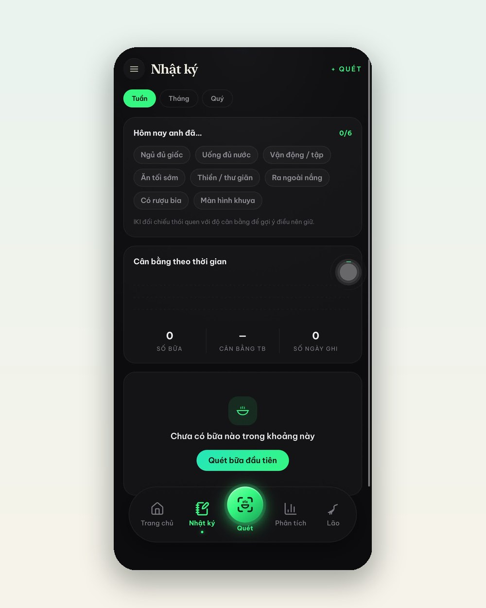
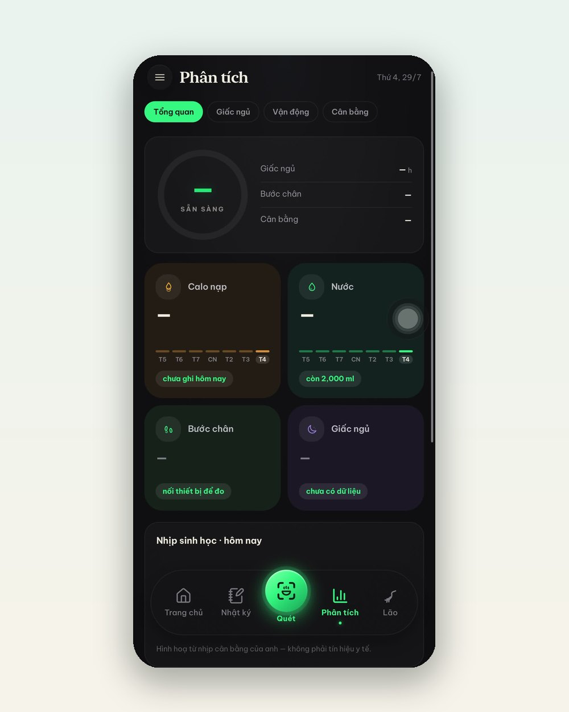

---json
{
  "title": "Nhật ký 30 giây mỗi ngày: cách App IKI giúp bạn nhìn ra quy luật cơ thể mình",
  "seo_title": "Nhật ký sức khoẻ 30 giây: tính năng Nhật ký & Phân tích App IKI",
  "slug": "app-iki-nhat-ky-30-giay-phan-tich",
  "description": "Sáu ô chạm nhanh mỗi tối — ngủ đủ, uống đủ nước, vận động, ăn tối sớm — và App IKI đối chiếu thói quen với độ cân bằng của bạn theo tuần. Xem tính năng Nhật ký và bảng Phân tích hoạt động thế nào qua ảnh màn hình thật.",
  "keyword": "nhật ký sức khoẻ hàng ngày",
  "category": "thoi-quen",
  "date": "2026-07-29",
  "author": "Đội ngũ IKI Healing",
  "hero_local": "assets/blog/app-iki-nhat-ky-30-giay-phan-tich-hero.jpg",
  "hero_alt": "Điện thoại và sổ tay nhỏ bên đèn ngủ",
  "reading_min": 6,
  "answer": "Tính năng Nhật ký của App IKI được thiết kế để chỉ tốn khoảng 30 giây mỗi ngày: một dàn ô chạm nhanh (ngủ đủ giấc, uống đủ nước, vận động, ăn tối sớm, thiền/thư giãn, ra ngoài nắng, có rượu bia, màn hình khuya) cộng với các bữa ăn đã quét tự động. Tab Phân tích sau đó đối chiếu thói quen với độ cân bằng theo tuần — giấc ngủ, bước chân, nước, calo — để bạn tự nhìn ra quy luật của chính mình và biết điều gì nên giữ. App là công cụ hỗ trợ lối sống tham khảo, không phải công cụ chẩn đoán y khoa.",
  "faq": [
    {
      "q": "Mỗi ngày tôi phải ghi những gì?",
      "a": "Chỉ chạm vào các ô mô tả đúng ngày của bạn: ngủ đủ giấc, uống đủ nước, vận động, ăn tối sớm, thiền hoặc thư giãn, ra ngoài nắng — và trung thực cả với hai ô \"có rượu bia\", \"màn hình khuya\". Bữa ăn thì quét bằng camera nên không cần gõ. Tổng thời gian khoảng 30 giây."
    },
    {
      "q": "Ghi nhật ký như vậy để làm gì?",
      "a": "Để app đối chiếu thói quen với độ cân bằng của bạn theo thời gian. Sau vài tuần, bạn sẽ thấy những liên hệ mà cảm tính không thấy — ví dụ tuần nào nhiều buổi màn hình khuya thì điểm cân bằng tụt. Biết quy luật của chính mình là nền tảng của sức khoẻ chủ động."
    },
    {
      "q": "Tôi có cần đeo thiết bị gì không?",
      "a": "Không bắt buộc. Nếu có sẵn thiết bị theo dõi sức khoẻ, bạn có thể nối để bước đi, giấc ngủ, nhịp tim tự chảy vào app; không có thì các ô chạm nhanh và tính năng quét bữa ăn vẫn đủ để app phác bức tranh tuần của bạn."
    }
  ]
}
---

"Lắng nghe cơ thể" là lời khuyên đúng nhưng mơ hồ: lắng nghe bằng cách nào, và làm sao nhớ nổi tuần trước cơ thể đã "nói" gì? [App IKI](https://ikihealing.com/app.html) trả lời bằng một thiết kế rất khiêm tốn: **một cuốn nhật ký chỉ tốn 30 giây mỗi ngày** — nhưng cộng dồn thành thứ đáng giá nhất: quy luật của chính bạn.

## Sáu ô chạm thay cho trang giấy

Đây là tab Nhật ký thật trong app:

Cuối ngày, bạn chạm vào những ô đúng với hôm nay: *Ngủ đủ giấc · Uống đủ nước · Vận động · Ăn tối sớm · Thiền/thư giãn · Ra ngoài nắng* — và trung thực cả với hai ô "tự thú": *Có rượu bia · Màn hình khuya*. Không cần viết gì. Dòng chữ nhỏ dưới dàn ô nói rõ mục đích: app **đối chiếu thói quen với độ cân bằng để gợi ý điều nên giữ**.

Bữa ăn thì đã có tính năng [quét bằng camera](app-iki-quet-bua-an-cham-am-duong.html) ghi tự động — nên phần "nhật ký ăn uống" gần như không tốn công.

## Tab Phân tích: nơi 30 giây mỗi ngày sinh lãi

Từng ngày lẻ không nói lên điều gì. Nhưng tab Phân tích gom chúng thành bức tranh tuần:

Bạn thấy calo nạp theo từng ngày trong tuần, nước hôm nay còn thiếu bao nhiêu so với mục tiêu, bước chân và giấc ngủ (tự đổ về nếu bạn nối thiết bị sức khoẻ sẵn có). Sau vài tuần, những liên hệ bắt đầu lộ ra — kiểu như: tuần nào chuỗi "màn hình khuya" dài thì cột giấc ngủ ngắn lại, và cảm giác uể oải giữa buổi xuất hiện nhiều hơn.

Đó chính là "lắng nghe cơ thể" phiên bản có dữ liệu: không phải cảm tính, không phải nhớ mang máng — mà là nhìn thấy.

:::case Chị Thảo, 39 tuổi, chủ cửa hàng hoa ở Đà Lạt
Chị từng nghĩ mình mệt vì "tuổi tác". Ghi nhật ký 30 giây được ba tuần, chị nhìn bảng phân tích và nhận ra một điều đơn giản: những hôm chị thấy nặng nề nhất đều là hôm trước đó chốt đơn trên điện thoại tới khuya. Không ai phán xét chị, không app nào mắng chị — chỉ là dữ liệu bày ra trước mắt. Chị tự đặt luật "10 giờ úp điện thoại xuống", và giữ được vì chính chị là người nhìn thấy lý do. Câu chuyện tổng hợp từ trải nghiệm thành viên cộng đồng IKI, tên nhân vật đã thay đổi.
:::

## Bắt đầu tối nay

1. Tải [App IKI](https://ikihealing.com/app.html) — bản miễn phí là đủ để bắt đầu nhật ký; gói IKI Pro (499.000đ/năm) mở sâu phần phân tích.
2. Làm [bài kiểm tra thể trạng 2 phút](https://ikihealing.com/quiz/) để app hiểu cơ địa bạn từ ngày đầu.
3. Tối nay trước khi ngủ, mở tab Nhật ký và chạm những ô đúng với hôm nay. 30 giây — thế thôi.

Một tháng sau, bạn sẽ có thứ mà không cuốn sách sức khoẻ nào cho được: bằng chứng về cách cơ thể **của riêng bạn** vận hành.

:::note Ghi chú pháp lý
App IKI là công cụ hỗ trợ lối sống mang tính tham khảo, không phải thiết bị y tế và không nhằm chẩn đoán bệnh. Biểu đồ trong app là hình hoạ từ nhịp sinh hoạt cá nhân, không phải tín hiệu y tế; nội dung bài viết không thay thế chẩn đoán hoặc tư vấn y khoa. Các sản phẩm IKI là thực phẩm bổ sung, không phải là thuốc và không có tác dụng thay thế thuốc chữa bệnh.
:::
