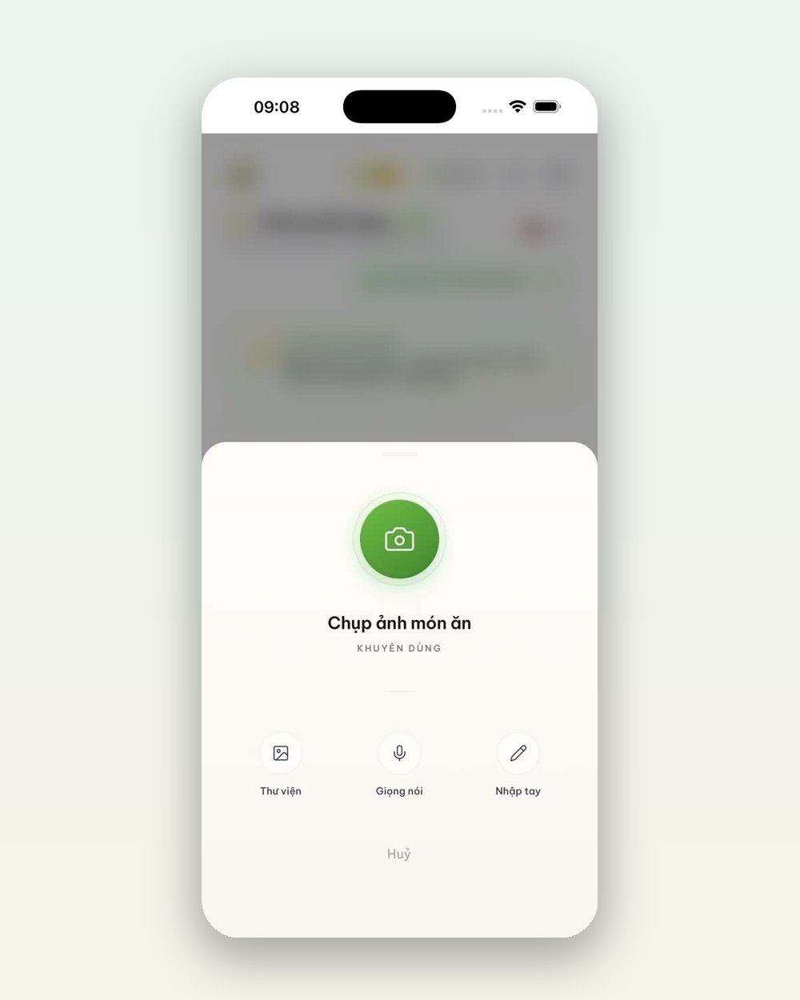
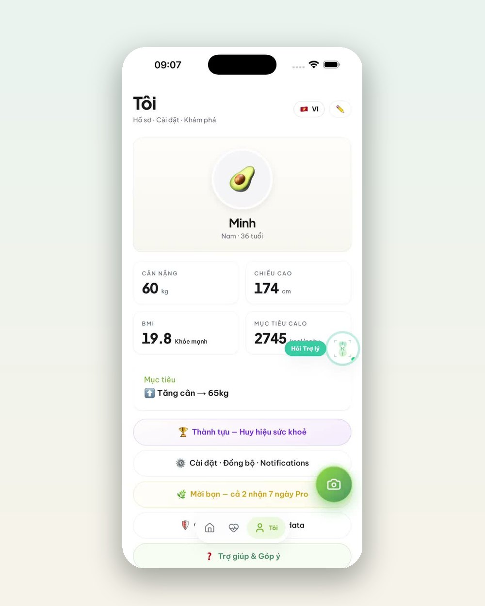

---json
{
  "title": "Quét bữa ăn 5 giây: App IKI đọc calo và chấm điểm Âm-Dương thế nào?",
  "seo_title": "App chấm điểm bữa ăn: quét calo và Âm-Dương với App IKI",
  "slug": "app-iki-quet-bua-an-cham-am-duong",
  "description": "Giơ máy lên chụp bữa ăn, App IKI nhận diện món, ước tính calo và chấm điểm Âm-Dương theo góc nhìn Đông y — kèm gợi ý cân bằng ngay tại chỗ. Xem tính năng quét bữa ăn hoạt động thế nào qua ảnh màn hình thật.",
  "keyword": "app chấm điểm bữa ăn",
  "category": "thoi-quen",
  "date": "2026-07-29",
  "author": "Đội ngũ IKI Healing",
  "hero_local": "assets/blog/app-iki-quet-bua-an-cham-am-duong-hero.jpg",
  "hero_alt": "Điện thoại đặt cạnh bữa ăn tươi",
  "reading_min": 6,
  "answer": "Tính năng Quét của App IKI cho phép chụp món ăn hoặc đồ uống, ứng dụng nhận diện món, ước tính lượng calo theo khẩu phần trung bình và chấm thêm một chỉ số riêng theo góc nhìn Đông y: điểm Âm-Dương — món thiên mát (Âm) hay thiên ấm (Dương). Dựa trên kết quả, app gợi ý một hành động cân bằng nhỏ ngay tại chỗ, ví dụ bài thở làm ấm 2 phút sau một món thiên mát, và tự ghi món vào nhật ký. Đây là công cụ hỗ trợ lối sống tham khảo, không phải công cụ chẩn đoán y khoa.",
  "faq": [
    {
      "q": "App IKI quét bữa ăn có chính xác không?",
      "a": "Con số calo là ƯỚC TÍNH theo khẩu phần trung bình của món được nhận diện — hữu ích để nhìn xu hướng ngày qua ngày, không phải cân đo tuyệt đối. Giá trị lớn nhất của việc quét là giúp bạn ghi lại bữa ăn đủ đều để thấy quy luật của chính mình."
    },
    {
      "q": "Điểm Âm-Dương nghĩa là gì?",
      "a": "Đó là cách App IKI diễn giải món ăn theo góc nhìn ẩm thực dưỡng sinh phương Đông: món thiên mát (Âm) hay thiên ấm (Dương), lệch nhiều hay ít. Điểm này mang tính tham khảo lối sống để bạn cân bằng bữa sau, không phải chỉ số y khoa."
    },
    {
      "q": "Dùng tính năng quét có mất phí không?",
      "a": "App IKI có bản miễn phí để bắt đầu; gói IKI Pro (499.000đ/năm) mở rộng chiều sâu phân tích và đồng hành. Bạn có thể dùng miễn phí trước, thấy hợp mới nâng cấp."
    }
  ]
}
---

Ghi nhật ký ăn uống là lời khuyên kinh điển của mọi chuyên gia dinh dưỡng — và cũng là thói quen bị bỏ cuộc nhanh nhất, vì gõ tay từng món mỗi bữa quá phiền. [App IKI](https://ikihealing.com/app.html) giải quyết đúng điểm bỏ cuộc đó: **giơ máy lên, chụp, xong**.

## Quét một chai nước cũng ra chuyện đáng ngẫm

Đây là màn hình thật khi quét một chai nước chanh muối quen thuộc:

Trong vài giây, app cho biết ba điều:

- **Món gì**: nhận diện "Nước chanh muối Sprite" từ ảnh chụp.
- **Khoảng bao nhiêu calo**: 149 kcal — ước tính theo khẩu phần trung bình, đủ để bạn giật mình "một chai nước ngọt gần bằng một bát cơm".
- **Điểm Âm-Dương**: -5, tức món thiên mát (Âm) — góc nhìn mà không app đếm calo nào khác có.

Điểm cuối cùng là thứ làm App IKI khác biệt. Ẩm thực dưỡng sinh phương Đông nhìn món ăn không chỉ bằng năng lượng mà bằng **tính ấm - mát**: nước đá, đồ ngọt lạnh thiên Âm; gừng, món nấu ấm thiên Dương. Cơ thể dễ chịu nhất khi hai phía không lệch quá xa nhau ngày này qua ngày khác.

## Không chỉ chấm điểm — gợi ý luôn việc cần làm

Chấm điểm xong mà để đó thì cũng chỉ là một con số. Ngay dưới kết quả, app gợi ý một hành động cân bằng nhỏ làm được tại chỗ: với món thiên mát ở ảnh trên, đó là **bài "Thở làm ấm" 2 phút** — nhịp thở gọn giúp làm ấm người và tỉnh táo lại. Bấm "Bắt đầu" là làm ngay, không cần rời màn hình.

Và món vừa quét được **tự ghi vào nhật ký** — bạn không phải làm gì thêm. Đó chính là lý do thói quen ghi bữa ăn bằng App IKI sống sót được: mỗi lần ghi chỉ tốn 5 giây.

## Cuối tuần, các cú quét biến thành bức tranh Âm-Dương của bạn

Từng cú quét lẻ tẻ sẽ được gom lại thành biểu đồ Âm-Dương theo ngày trong tab Phân tích:

Bạn nhìn thấy ngay tuần vừa rồi mình nghiêng Âm hay nghiêng Dương, hôm nào "lệch mạnh", và bảng chỉ số hôm nay so với trung bình 14 ngày (calo nạp, nước so với mục tiêu 2 lít, bước chân so với mục tiêu 8.000). Không cần nhớ gì cả — dữ liệu tự kể chuyện.

:::note Minh bạch để bạn yên tâm
Ngay trong app có dòng chữ: "Hình hoạ từ nhịp cân bằng của anh — không phải tín hiệu y tế". App IKI là công cụ hỗ trợ lối sống tham khảo giúp bạn quan sát bản thân; mọi vấn đề sức khoẻ cần được thăm khám với bác sĩ. Chúng tôi ghi rõ điều này ở mọi nơi trong sản phẩm.
:::

## Bắt đầu thế nào

1. Tải [App IKI](https://ikihealing.com/app.html) (miễn phí để bắt đầu; gói IKI Pro 499.000đ/năm khi bạn muốn phân tích sâu hơn).
2. Chưa rõ cơ địa mình thiên Hàn hay Nhiệt? Làm [bài kiểm tra thể trạng 2 phút](https://ikihealing.com/quiz/) — kết quả sẽ giúp các gợi ý cân bằng trong app hợp với bạn hơn.
3. Quét bữa đầu tiên ngay hôm nay — bữa nào cũng được, kể cả một chai nước.

Một cú chụp 5 giây mỗi bữa — sau hai tuần, bạn sẽ hiểu cái miệng của mình hơn cả chục năm qua cộng lại.

:::note Ghi chú pháp lý
App IKI là công cụ hỗ trợ lối sống mang tính tham khảo, không phải thiết bị y tế và không nhằm chẩn đoán bệnh. Nội dung bài viết không thay thế chẩn đoán hoặc tư vấn y khoa. Các sản phẩm IKI là thực phẩm bổ sung, không phải là thuốc và không có tác dụng thay thế thuốc chữa bệnh.
:::
