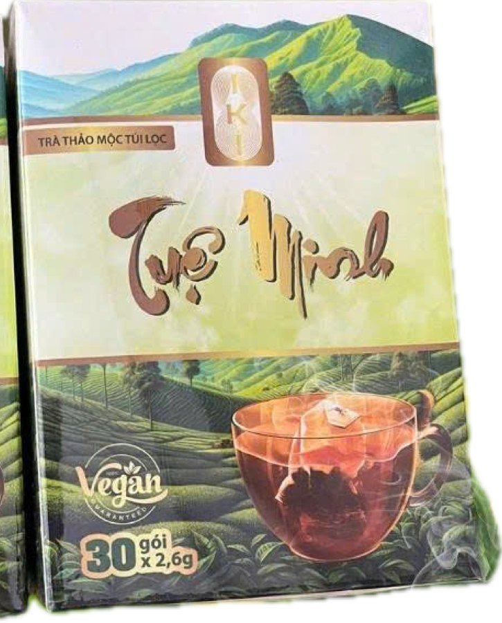

---json
{
  "title": "Trà thảo mộc uống ấm mỗi ngày: cách chọn và gợi ý Trà Tuệ Minh",
  "seo_title": "Trà thảo mộc uống mỗi ngày: cách chọn và Trà Tuệ Minh",
  "slug": "tra-thao-moc-tue-minh",
  "description": "Chọn trà thảo mộc uống ấm mỗi ngày thế nào? Tiêu chí nguyên liệu, hương vị, thời điểm uống, so sánh các nhóm trà thảo mộc và Trà Tuệ Minh - trà túi lọc thảo mộc Việt cho nếp uống hằng ngày.",
  "keyword": "trà thảo mộc",
  "category": "thuc-pham",
  "date": "2026-07-22",
  "updated": "2026-07-22",
  "author": "Đội ngũ Health Coach IKI",
  "hero_local": "assets/blog/tra-thao-moc-tue-minh-hero.jpg",
  "hero_alt": "Trà thảo mộc uống ấm mỗi ngày",
  "reading_min": 13,
  "answer": "Chọn trà thảo mộc cho thức uống ấm mỗi ngày nên dựa trên nguyên liệu rõ ràng, hương vị hợp khẩu vị và thời điểm uống phù hợp. Trà thảo mộc là thức uống hãm từ hoa, lá, rễ, quả của thảo mộc, phần lớn ít hoặc không caffeine nên nhiều người chọn uống buổi tối để có cảm giác thư thái, ấm bụng. Hãy ưu tiên trà nhạt, ít đường, nguyên liệu minh bạch và uống từ tốn khi còn ấm. Trà Tuệ Minh là một lựa chọn thảo mộc Việt cho nếp uống ấm hằng ngày. Người có bệnh nền, đang mang thai hoặc cho con bú nên hỏi ý kiến bác sĩ trước khi dùng đều đặn.",
  "faq": [
    {
      "q": "Trà thảo mộc là gì và khác gì trà xanh, trà đen?",
      "a": "Trà thảo mộc là thức uống hãm từ hoa, lá, rễ, quả của các loại thảo mộc như hoa cúc, gừng, sả, cà gai leo, giảo cổ lam. Khác với trà xanh và trà đen vốn làm từ cây trà (Camellia sinensis) và thường chứa caffeine, phần lớn trà thảo mộc không có hoặc rất ít caffeine, nên nhiều người chọn uống vào buổi tối để giữ cảm giác nhẹ nhàng trước giờ nghỉ."
    },
    {
      "q": "Nên chọn trà thảo mộc dựa trên tiêu chí nào?",
      "a": "Ba tiêu chí đáng cân nhắc là: nguyên liệu rõ ràng và có nguồn gốc (biết trong trà có những vị thảo mộc nào), hương vị hợp khẩu vị để duy trì được lâu, và độ tiện phù hợp với nếp sinh hoạt. Ngoài ra nên ưu tiên loại ít hoặc không đường, đóng gói minh bạch thông tin nhà sản xuất và hạn dùng. Một loại trà bạn thấy dễ uống mỗi ngày sẽ hợp hơn loại cầu kỳ mà bạn ngại pha."
    },
    {
      "q": "Uống trà thảo mộc vào lúc nào trong ngày là hợp lý?",
      "a": "Nhiều người thấy dễ chịu khi uống một tách trà thảo mộc ấm sau bữa ăn khoảng 30 phút để cảm giác nhẹ bụng hơn, hoặc vào buổi tối như một nghi thức thư giãn trước khi ngủ. Buổi sáng bạn có thể bắt đầu bằng nước ấm rồi mới tới trà. Hãy tránh uống trà quá đặc lúc bụng rỗng và quan sát phản ứng của cơ thể để chọn khung giờ hợp với mình."
    },
    {
      "q": "Trà Tuệ Minh gồm những vị thảo mộc nào?",
      "a": "Trà Tuệ Minh là sự phối hợp của các vị thảo mộc Việt quen thuộc trong dân gian như cà gai leo, xạ đen, giảo cổ lam, cốt toái bổ và cây xấu hổ. Đây là những nguyên liệu thảo mộc, được hãm thành một thức uống ấm, hương vị dịu, phù hợp cho nếp uống ấm thư thái hằng ngày. Bạn có thể tìm hiểu thêm cách phối và cách pha tại trang sản phẩm."
    },
    {
      "q": "Uống trà thảo mộc mỗi ngày có ổn không?",
      "a": "Với phần lớn người khỏe mạnh, một đến hai tách trà thảo mộc nhạt mỗi ngày là một thói quen uống dễ chịu và ít calo nếu không thêm nhiều đường. Điều quan trọng là uống điều độ, luân phiên các loại và không xem trà như thứ thay thế nước lọc hay bữa ăn. Nếu bạn đang mang thai, cho con bú, có bệnh nền hoặc đang được bác sĩ theo dõi, hãy hỏi ý kiến bác sĩ trước khi dùng đều đặn."
    },
    {
      "q": "Pha trà thảo mộc thế nào cho ngon và giữ hương?",
      "a": "Với trà túi lọc, hãy dùng nước nóng khoảng 90 đến 95 độ, hãm chừng 3 đến 5 phút rồi lấy túi ra để tránh vị chát. Với thảo mộc khô rời, bạn có thể hãm lâu hơn một chút và đậy nắp để giữ hương. Uống khi trà còn ấm sẽ dễ chịu nhất, và hạn chế cho nhiều đường để giữ vị thanh tự nhiên của thảo mộc."
    }
  ],
  "related": [
    {
      "title": "Thức uống ấm mỗi ngày và trà thảo mộc",
      "url": "thuc-uong-am-tra-thao-moc.html"
    },
    {
      "title": "Gia vị Việt: gừng, nghệ, sả",
      "url": "gia-vi-viet-gung-nghe-sa.html"
    },
    {
      "title": "5 thể tạng theo Đông y",
      "url": "5-the-tang-theo-dong-y.html"
    },
    {
      "title": "Uống nước đúng cách mỗi ngày theo thể tạng",
      "url": "uong-nuoc-dung-cach-moi-ngay.html"
    }
  ]
}
---

Có một khoảnh khắc trong ngày mà nhiều người rất trân trọng: lúc ngồi xuống với một tách trà ấm, hơi nước bốc lên nhè nhẹ, và trong vài phút ngắn ngủi ấy, nhịp sống chậm lại. Đó có thể là buổi sáng tinh mơ trước khi bắt đầu công việc, hay buổi tối yên tĩnh sau một ngày dài. Thức uống ấm, đặc biệt là trà thảo mộc, từ lâu đã là một phần trong nếp sống của người Việt, không phải như một thứ gì cao siêu, mà như một thói quen giản dị nuôi dưỡng cảm giác dễ chịu.

Nhưng khi muốn chọn một loại trà thảo mộc để uống đều đặn, không ít người lại phân vân. Trên thị trường có vô số loại: trà túi lọc, thảo mộc khô rời, trà phối nhiều vị, mỗi loại quảng cáo một kiểu. Bài viết này sẽ cùng bạn xây một cách chọn tỉnh táo: hiểu trà thảo mộc là gì, dựa vào tiêu chí nào để chọn, so sánh các nhóm trà phổ biến, rồi nhìn tới một gợi ý cụ thể là Trà Tuệ Minh cho nếp uống ấm hằng ngày. Xin nói trước để rõ tinh thần: đây là câu chuyện về một thức uống dễ chịu và một thói quen thư thái, không phải về bất kỳ giải pháp sức khỏe nào.

## Vì sao một nếp uống ấm lại đáng có

Cơ thể chúng ta phản ứng khá rõ với nhiệt độ của thứ mình đưa vào. Với nhiều người, một thức uống ấm vào buổi sáng sau khi thức dậy mang lại cảm giác ấm bụng, dễ chịu, như một cách nhẹ nhàng đánh thức cơ thể. Vào những ngày se lạnh, hay sau một bữa ăn, một tách trà ấm cũng thường tạo cảm giác thoải mái hơn so với đồ uống lạnh.

Ngoài yếu tố nhiệt độ, bản thân hành động pha và thưởng trà còn mang một giá trị tinh thần. Trong nhịp sống hối hả, việc dừng lại vài phút để hãm một tách trà, hít hà mùi hương và uống từ tốn là một khoảng lặng quý giá. Nhiều người xem đây như một nghi thức nhỏ giúp tâm trí chậm lại, thư thái hơn giữa những bận rộn. Chính khoảnh khắc chậm lại ấy, chứ không riêng gì tách trà, mới là điều nuôi dưỡng cảm giác dễ chịu.

Trà thảo mộc còn có một ưu điểm thực tế: phần lớn không hoặc rất ít caffeine, nên hợp để uống cả vào buổi tối mà không lo ảnh hưởng tới cảm giác tỉnh táo. Nếu không thêm nhiều đường, đây cũng là một thức uống ít calo, dễ đưa vào nếp sinh hoạt hằng ngày. Với những ai đang muốn giảm bớt trà sữa hay nước ngọt, một tách trà thảo mộc nhạt là lựa chọn thay thế nhẹ nhàng và tiết kiệm.

## Tiêu chí chọn một loại trà thảo mộc để uống đều

Vì đây là thứ bạn định uống thường xuyên, việc chọn nên dựa trên vài tiêu chí thực tế thay vì chỉ theo bao bì bắt mắt.

### Nguyên liệu rõ ràng

Điều đầu tiên đáng nhìn là trong trà có những gì. Một loại trà thảo mộc tốt thường ghi rõ các vị thảo mộc thành phần, nguồn gốc và nhà sản xuất. Bạn nên ưu tiên sản phẩm minh bạch thay vì loại chỉ ghi chung chung là "trà thảo mộc" mà không nói rõ chứa vị gì. Biết rõ nguyên liệu cũng giúp bạn tránh những vị mình không hợp hoặc không thích.

### Hương vị hợp khẩu vị

Đây là tiêu chí quyết định bạn có duy trì được thói quen hay không. Một loại trà dù được khen đến mấy mà bạn thấy khó uống thì cũng khó gắn bó lâu. Hãy chọn loại có hương vị dịu, dễ chịu với khẩu vị của bạn, không quá đắng hay quá nồng. Nếu có thể, hãy thử một lượng nhỏ trước khi quyết định uống đều.

### Thời điểm và mục đích uống

Bạn muốn một tách trà ấm để bắt đầu buổi sáng, để nhấm nháp sau bữa ăn cho nhẹ bụng, hay để thư giãn vào buổi tối? Mục đích khác nhau có thể dẫn tới lựa chọn khác nhau. Với thức uống buổi tối, người ta thường ưu tiên loại không caffeine và hương vị êm dịu để giữ cảm giác thư thái. Xác định rõ mình uống khi nào giúp bạn chọn đúng và tận hưởng trọn vẹn hơn.

### Sự tiện lợi

Cuối cùng là yếu tố thực tế: bạn có thời gian và sự kiên nhẫn để pha cầu kỳ không? Trà túi lọc tiện và nhanh, hợp người bận. Thảo mộc khô rời cho hương vị đậm đà hơn nhưng cần thao tác hãm và lọc. Hãy chọn dạng phù hợp với nhịp sống để việc uống trà là niềm vui chứ không thành gánh nặng.

## So sánh các nhóm trà thảo mộc phổ biến

Để dễ hình dung, hãy điểm qua vài nhóm trà thảo mộc quen thuộc với người Việt, cùng đặc điểm của từng loại.

**Trà hoa (hoa cúc, hoa nhài, hoa hòe).** Hương thơm nhẹ nhàng, vị thanh, thường được yêu thích vì cảm giác dịu dàng và dễ uống. Hợp cho buổi tối hoặc lúc muốn một tách trà nhẹ. Điểm cần lưu ý là chọn hoa sạch, phơi sấy kỹ để giữ hương và tránh ẩm mốc.

**Trà gia vị ấm (gừng, sả, quế).** Vị ấm nồng, hợp những ngày lạnh hoặc khi muốn một tách trà đậm hương. Gừng và sả là những vị rất Việt, dễ tìm, dễ tự pha tại nhà. Bạn có thể đọc thêm về nhóm này trong bài [Gia vị Việt: gừng, nghệ, sả](gia-vi-viet-gung-nghe-sa.html). Điểm lưu ý là những vị này khá nồng, nên pha nhạt vừa phải để dễ uống.

**Trà thảo mộc phối nhiều vị.** Đây là các sản phẩm kết hợp nhiều loại thảo mộc để tạo hương vị hài hòa và phong phú hơn. Ưu điểm là tiện, đã được cân chỉnh sẵn tỉ lệ, hợp người không có thời gian tự phối. Điểm cần nhìn là bảng thành phần rõ ràng và uy tín của nhà sản xuất, vì bạn đang tin vào công thức của họ.

**Thảo mộc Việt truyền thống (cà gai leo, giảo cổ lam, xạ đen).** Đây là những vị thảo mộc quen thuộc trong dân gian Việt Nam, thường được hãm làm thức uống ấm. Nhiều loại có vị hơi đắng nhẹ đặc trưng mà người quen uống lại thấy dễ chịu. Nhóm này thường xuất hiện trong các sản phẩm trà thảo mộc phối vị của người Việt.

Nhìn chung, không có nhóm nào "đúng" cho tất cả mọi người. Lựa chọn tùy thuộc vào khẩu vị, thời điểm uống và cả thể tạng của bạn. Nếu muốn hiểu thêm về việc điều chỉnh thức uống theo cơ thể mình, bài [5 thể tạng theo Đông y](5-the-tang-theo-dong-y.html) sẽ cho bạn một góc nhìn thú vị.

## Trà Tuệ Minh — một lựa chọn thảo mộc Việt cho nếp uống ấm

Xem [thông tin đầy đủ về Trà Tuệ Minh](../san-pham/tra-tue-minh.html): thành phần, quy cách, cách pha đúng nhiệt độ và giá niêm yết.

Trong nhóm trà thảo mộc phối vị của người Việt, [Trà Tuệ Minh](https://tra.ikihealing.com) là một gợi ý đáng cân nhắc nếu bạn thích một thức uống ấm với các vị thảo mộc truyền thống. Hãy soi nó qua bộ tiêu chí ở trên.

Về nguyên liệu, Trà Tuệ Minh là sự phối hợp của năm vị thảo mộc Việt quen thuộc trong dân gian: cà gai leo, xạ đen, giảo cổ lam, cốt toái bổ và cây xấu hổ. Đây đều là những nguyên liệu thảo mộc có mặt lâu đời trong nếp uống của người Việt. Việc biết rõ trong trà có những vị nào đáp ứng tiêu chí nguyên liệu minh bạch mà chúng ta đã nói ở trên.

Về hương vị và cách dùng, đây là một thức uống thảo mộc ấm, hương dịu, được nhiều người trong cộng đồng chọn cho nếp uống ấm thư thái hằng ngày, thường là một đến hai tách mỗi ngày. Bạn có thể hãm và uống khi còn ấm, nhấm nháp từ tốn như một khoảng lặng nhỏ trong ngày. Với người thích cảm giác một tách trà ấm sau bữa ăn hoặc vào buổi tối, đây là một lựa chọn phù hợp về mặt nếp sống.

Cần nói rõ để tránh hiểu lầm: Trà Tuệ Minh là một thức uống thảo mộc, phù hợp làm một phần của nếp sinh hoạt lành mạnh và một thói quen uống ấm thư thái. Đây không phải là sản phẩm dùng để phòng hay thay đổi bất kỳ tình trạng bệnh lý nào, và không thay thế nước lọc hay bữa ăn. Nếu bạn quan tâm tới cách phối vị và cách pha cụ thể, có thể tìm hiểu thêm tại trang [Trà Tuệ Minh](https://tra.ikihealing.com) rồi tự cân nhắc xem hương vị và nếp uống ấy có hợp với mình không.

## Đưa nếp uống ấm vào ngày của bạn

Một tách trà thảo mộc chỉ thực sự có ý nghĩa khi nó trở thành thói quen dễ chịu, chứ không phải việc gắng gượng. Vài gợi ý để bắt đầu nhẹ nhàng:

1. **Chọn một khung giờ cố định.** Có thể là tách trà sau bữa tối, hoặc lúc ngồi vào bàn làm việc buổi chiều. Gắn thói quen mới vào một mốc quen thuộc sẽ giúp nó dễ duy trì hơn.
2. **Pha nhạt và ít đường.** Để cảm nhận trọn hương vị tự nhiên của thảo mộc, hãy pha vừa phải và hạn chế thêm đường. Vị thanh nhẹ thường dễ uống lâu dài hơn vị ngọt gắt.
3. **Uống khi còn ấm, từ tốn.** Phần lớn giá trị dễ chịu của trà đến từ hơi ấm và khoảnh khắc chậm lại. Đừng vội, hãy để vài phút thưởng trà là một quãng nghỉ thật sự.
4. **Luân phiên các loại.** Đổi vị theo mùa và tâm trạng giúp thói quen không nhàm chán. Ngày lạnh chọn vị ấm nồng, ngày oi chọn vị thanh mát nhẹ.
5. **Lắng nghe cơ thể.** Mỗi người hợp một kiểu khác nhau. Nếu thấy một loại trà không dễ chịu với mình, hãy đổi loại khác; và nếu có bệnh nền, hãy hỏi ý kiến bác sĩ trước khi dùng đều đặn. Vì mỗi người một thể trạng khác nhau, bạn có thể [kiểm tra thể trạng 90 giây](https://ikihealing.com/quiz) để biết nếp uống ấm nào hợp với mình.

:::case Cảm nhận từ cộng đồng IKI (ẩn danh)
Chị N., 45 tuổi, làm kế toán ở Hải Dương, kể rằng nhiều năm liền thức uống quen thuộc của chị là cà phê sữa buổi sáng và nước đá suốt cả ngày, một phần vì văn phòng lúc nào cũng có sẵn bình nước lạnh. Mỗi tối về nhà, chị thấy mình "chạy" từ việc cơ quan sang việc nhà mà không có lấy một khoảng nghỉ đúng nghĩa. Khi tham gia cộng đồng IKI, chị bắt đầu từ một thay đổi rất nhỏ: chuyển sang ăn uống đồ ấm, tránh đồ lạnh, đặc biệt vào buổi sáng và buổi tối. Chị sắm một bình giữ nhiệt để trên bàn làm việc, sáng rót nước ấm mang theo, tối sau khi dọn dẹp xong thì hãm một tách trà thảo mộc, ngồi uống chậm rãi chừng mười phút trước khi nghỉ. Có hôm bận quá quên mất, chị cũng không tự trách, hôm sau lại quay về nếp cũ. Dần dần, cả nhà quen với hình ảnh chị ngồi bên tách trà bốc khói ở góc bếp mỗi tối. Điều chị tâm đắc nhất không phải là một loại trà cụ thể, mà là cảm giác dễ chịu khi giữ được nếp uống ấm đều đặn, và khoảnh khắc yên tĩnh hiếm hoi mà tách trà mang lại giữa một ngày bận rộn. Chị bảo tách trà tối giờ giống như một "dấu chấm xuống dòng" cho ngày của mình. (Đây là trải nghiệm cá nhân về thói quen sinh hoạt, không phải lời khuyên y khoa hay cam kết về sức khỏe; cảm nhận có thể khác nhau ở mỗi người.)
:::

## Câu hỏi thường gặp khi chọn mua trà thảo mộc

Trước khi chọn một loại trà để uống đều, nhiều người băn khoăn ở vài điểm rất thực tế.

**Nên mua trà túi lọc hay thảo mộc khô rời?** Tùy nhịp sống của bạn. Túi lọc tiện, nhanh, sạch sẽ, hợp người bận và mới bắt đầu. Thảo mộc khô rời cho hương vị đậm đà và cảm giác pha trà truyền thống hơn, nhưng cần thời gian và dụng cụ lọc. Nhiều người bắt đầu bằng túi lọc rồi mới chuyển sang khô rời khi đã thành thói quen.

**Trà phối sẵn nhiều vị có tốt không?** Ưu điểm là đã được cân chỉnh tỉ lệ, tiện và hương vị hài hòa. Điều cần nhìn là sự minh bạch của thành phần và uy tín nhà sản xuất, vì bạn đang tin vào công thức của họ. Một sản phẩm ghi rõ các vị thảo mộc bên trong luôn đáng tin hơn loại mập mờ.

**Uống bao nhiêu một ngày là vừa?** Với người khỏe mạnh, một đến hai tách trà nhạt mỗi ngày là mức nhiều người thấy dễ chịu. Quan trọng là điều độ, không uống quá đặc và không xem trà thay cho nước lọc. Nếu có thắc mắc riêng về sức khỏe, hãy hỏi bác sĩ.

**Mua thử ít hay mua nhiều luôn?** Với loại lần đầu dùng, nên mua lượng vừa để thử hương vị và xem có hợp khẩu vị không, tránh lãng phí. Khi đã ưng, bạn có thể mua nhiều hơn cho tiện.

## Kết

Chọn một loại trà thảo mộc để uống đều mỗi ngày, suy cho cùng, là chọn một thói quen dễ chịu hợp với mình: nguyên liệu rõ ràng, hương vị bạn thích, thời điểm uống phù hợp và cách pha vừa sức. Khi có những tiêu chí này, bạn sẽ chọn được thứ mình gắn bó lâu dài thay vì mua theo phong trào rồi bỏ dở.

Nếu bạn thích một thức uống thảo mộc ấm với các vị Việt truyền thống, [Trà Tuệ Minh](https://tra.ikihealing.com) là một lựa chọn đáng thử cho nếp uống ấm thư thái. Nhưng dù chọn loại nào, hãy nhớ điều quan trọng nhất nằm ở chính khoảnh khắc bạn dừng lại, pha một tách trà và cho mình vài phút chậm lại. Đó là một cách giản dị để chăm sóc bản thân giữa nhịp sống bận rộn. Muốn hiểu thêm về thói quen uống ấm nói chung, bạn có thể đọc bài [Thức uống ấm mỗi ngày và trà thảo mộc](thuc-uong-am-tra-thao-moc.html).

:::note Số liệu thực tế từ cộng đồng IKI
Trà thảo mộc là nhóm sản phẩm được chọn nhiều thứ hai (10,3% giá trị giỏ hàng) trong dữ liệu 1.540 đơn hàng thực tế kỳ 03–07/2026 của IKI Healing — chỉ sau đạm thực vật. Xem đầy đủ trong [Báo cáo chăm sóc sức khoẻ chủ động 2026](bao-cao-cham-soc-suc-khoe-chu-dong-2026.html).
:::
